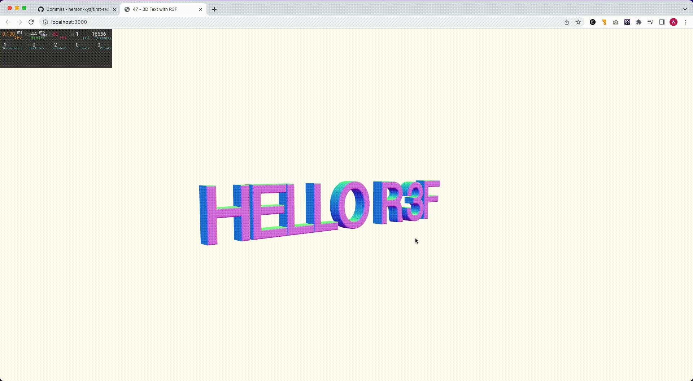

## First React-Three-Fiber App

### GIF of Latest Progress

### Getting Started
These instructions will get you a copy of the project up and running on your local machine for development and testing purposes. See deployment for notes on how to deploy the project on a live system.

### Prerequisites
- Node.js
- npm (or yarn)

### Installation
- Clone the repository
- Navigate to the project directory
- Run npm install (or yarn install) to install the dependencies
- Run npm start (or yarn start) to start the development server

### Built With
- React
- Three.js
- React-Three-Fiber

### License
This project is licensed under the MIT License - see the LICENSE file for details.